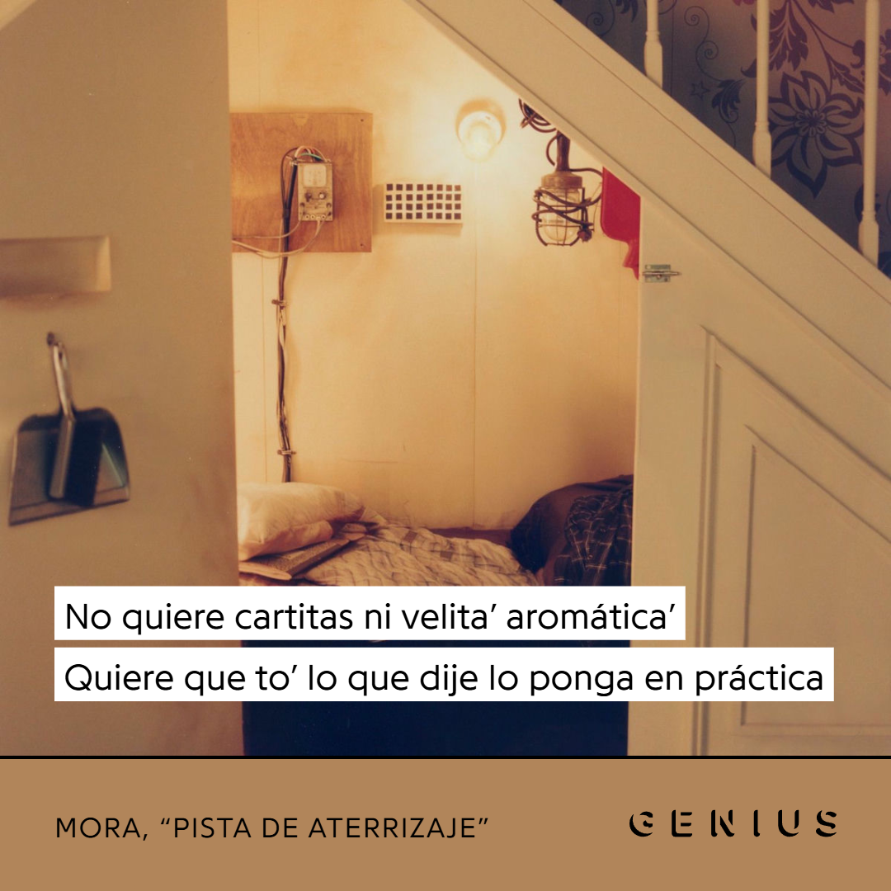
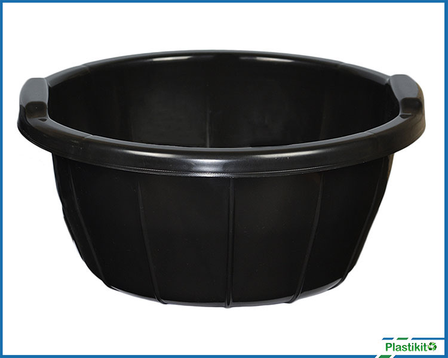
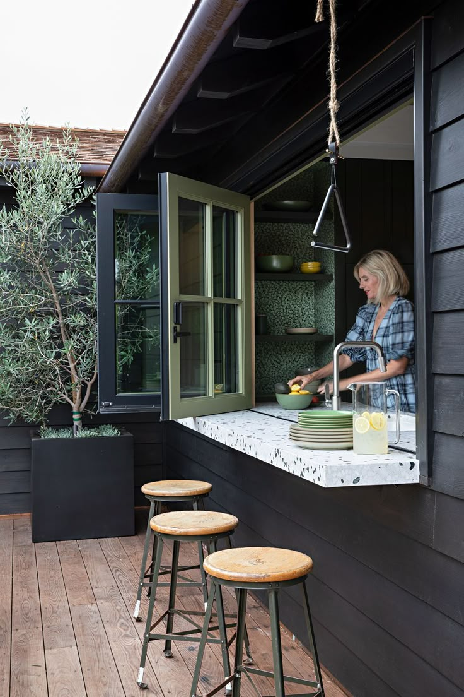
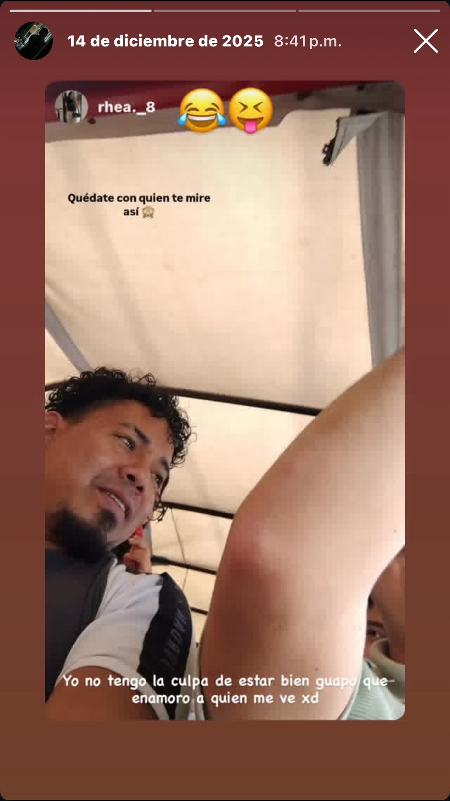

# Introducción
Hola wenas, gracias por no virarse ni chotear ni tampoco dejarme de lado y mandarme pal carajo, los quiero a cada uno, perdón por como los he tratado y como me he alejado de ustedes, les agradezco cada detalle y cada cosa que hicieron por mí, este es un obsequio de paz donde les quiero contar mi travesía que llevo meses queriendoles contar. Sin nada más que decir que empiece esta vaina xd

# Prólogo
No sé si recuerdan que en el cumpleaños de Marjorie les dije que me interesaba una chava (si no se acuerdan su user de insta es @rhea8._8 pa que watcheen XD), la cosa es que pasaron ciertas vainas entre ella y yo, no tanto como hubiera querido pero he "hecho" más vainas con ella que con otras chavas como G y S XD. 

Van a haber partes del texto que se van a ver `de esta manera` pa que le pongan atención y al final me digan su opinión xd.

# Antecedentes
Para empezar, un detalle muy importante es que ella, si mal no estoy, estudia en la UPANA, y ella estudia enfermería. Ella cumpleaños el 8 de septiembre, lo que si no recuerdo es si en este momento tiene 21 o 22, pero la cosa es que es mayor que yo xd. 
Hubo un día donde yo hablé con Janna en una ocasión que hubo una salida a una iglesia de la misión pero no pasó a tanto, pero ya se había sembrado una semillita ahí xd. También (no recuerdo la fecha) a Juan Carlos le había contado que me interesaba Janna, pero eso surgió porque le iba a hablar a Janna directamente pero no surgió ya que no agarré valor xd. Juan Carlos medio me dijo que Janna si es una chava medio complicada con las relaciones, ya que ha visto como se abruma cuando sabe que a alguien le gusta o cosas así. Además yo había notado que ella AVC llegaba a la iglesia y estaba triste, molesta o abrumada, donde no le habla a nadie o algo parecido.

Decidí después de tanto reflexionar, que iba a ir poco a poco, donde no le iba a decir de una que me interesaba y tampoco iba a decirle a todo el mundo que ella me interesaba. Por ello, al principio fui haciendo pocas acciones y viendo que reacciones lograba con ello porque de esa manera veía si algo me convenía o no me convenía. Así que a continuación está el storytime de lo que pasó, pueda ser que algún detalle o cosa se me olvidé pero que les puedo decir xd.

# Storytime
## 8/11/2025 - La boda
En este día fue el evento canon porque hubieron muchas cosas que me explotaron la cabeza y de ahí se originó todo.
Pa comenzar en la iglesia hubo una boda y en un terreno de la iglesia se celebró la "fiesta" o celebración de ello. Como dato extra es cerca por donde vive Janna y toda su familia y además en ese terreno está otra iglesia y también vive una su tía. También otro dato es que Janna es nieta del Pastor entonces ajá xd.

La vaina es que quería hablar con ella pa conocerla y ver si era factible el tener algo con ella porque solo sabía vainas que me contaban o que veia. La manera en que me acerqué a ella fue fácil porque ella se puso en el candy bar y estaba ella solita entonces en un momento donde no mucha mara iba aproveché a ir para hablarle. Donde le metí la casaca que no tenía con quien hablar y que al llevarnos bien pos quería hablar con ella (una vaina así recuerdo xd). Entonces de buena manera hablamos tranquilos y aquí viene lo bueno xd.

Hubieron varias "Fases" en esta plática entonces ajá:

### Fase I
En esta fase hablamos de como nos iba en la U tanto a ella como a mí, de nuestro futuro en la U a corto plazo y si mal no estoy aquí fue donde me dice que estaría bien que me metiera al Gym entonces yo le dije que si me iba a meter y todo xd. Luego llegó un momento donde la mara empezó a llegar al Candy Bar y nos cortaba la conversación entonces ella fue la que me propuso de ir a otro lugar ya más calmado donde pudieramos hablar bien y así fue, nos fuimos casi cerca de donde estabamos pero como que en la "salida" ya que por ahí tenía que pasar la genta pa salir pero no era la salida en sí xd.

### Fase II
Seguimos hablando hasta que `me preguntó acerca de S`, pero la manera que me pregunto fue de forma curiosa y yo le dije acerca de que había intentado algo con ella en abril/2025 pero nada funkó y que me había costado olvidarla y dejarla ir. Entonces de la nada me dice `"Sabes lo que te hace falta, coger"`, hubieron 3 segundos que se me congeló el cerebro pero logré decirle `"Concuerdo pero no hay con quién"`, le dije eso porque quería ver si era una propuesta indecente o que putas xd. También me preguntó `si era virgen` donde le dije que si, se sorprendió y no me creía del todo xd. 
Luego me contó acerca de su `su ex llamado Javier`, que para resumir el storytime. Él le propuso matrimonio, hasta había hablado con sus papás y su abuelo (que es el Pastor de la iglesia donde voy) y todos le dijeron que estaba bien. Pero ella al fin y al cabo no aceptó. Incluso me contó que el papá de un su tío que también es pastor le había dicho que ese maje no iba a ser su esposo y al final su cumplió.

También me dijo que `la maternidad está romantizada y que no quiere tener hijos`. También me lanzó que `no sabe si le gusta a alguien` excepto de un maje de la iglesia llamado `Ricardo` (guarden ese nombre porque más adelante este personaje es importante). Yo también le dije que no sabía si a alguien yo le gustaba `tirandosela para ver que me decía` o capaz se me declaraba o me decía si Juan Carlos le había choteado algo (que en pocas palabras no recuerdo que me respondió pero Juan Carlos no choteó nada xd) ni tampoco me dijo si yo le gustaba a alguien xd. También me mencionó que `no diferenciaba cuando alguien le ligaba o trataba de ser amable` ya que al ser ella la hermana de en medio (tiene una hermana mayor llamada `Andy` (quedense con ese nombre, porque también más adelante es importante) y una hermana menor llamada Zoe) muchos hombres se acercaban a ella con tal de entrarle a Andy. No sé si me tiró porque `en varias ocasiones le daba like a sus historias` entonces ajá.

Llegó un momento en el cual en la conversación le dije `que no quería entrarle a una chava sin saber si yo le gustaba`, tirandosela por si yo le gustaba me dijera algo pero solo me dijo que ella hace lo mismo xd. Llegó otro momento de la conversación donde me dijo `a mí ya no me importa el físico o la situación económica, yo prefiero que me haga reir` entonces le dije `el que te hace reir te hace gemir` ahí también tirandosela como indirecta directa porque desde que comenzamos a hablar en este día hasta este momento habían pasado como 30 o 45 minutos y pasamos el mayor tiempo riendonos y carcajeandonos xd. Si mal no recuerdo me preguntó acerca `de que quería en este momento con una relación` ya sea algo serio o pasajero, y le dije que ya estaba resignado del amor y por ello preferiría algo pasajero peeeeeero que dependiendo de la persona podía terminar como Pasajero de Mora xd, ella no sabía ni que canción era y le conté sobre que hablaba la rola (no recuerdo que me respondió xd).

Para finalizar esta fase llego el momento que partieron el pastel y empezaron a repartirlo entonces a ella se le cayó su tenedor y `fue acción instantanea que le di el mío`, ella no quería al principio pero al final acepto y me tuve que comer el pastel con la mano (un alma por otra alma xd). Llegó el momento que llegó el momento de tirar el ramo y el esposo y esposa lo tiraron y pasaron todos los solteros y solteras menos Janna y yo `porque por mi parte andaba cómodo con ella y como ella no pasó yo tampoco xd`. 

### Fase III
Después de lo anterior se nos olvidó de que estabamos hablando entonces hablamos de otras vainas. Como yo ya iba a estar en vacaciones, en la iglesia normalmente hay un culto de ayuno y oración que se hace en las mañanas, entonces ella me mencionó que iba a estar llegando junto con su hermana Andy entonces yo le dije que cuando yo estuviera en vacaciones también iba a estar llegando `Spoiler: esto porque hubieron varias veces que después del culto me acercaba a ella y nos poniamos a hablar`. Llegó un momento donde mi mamá me dijo si me iba a ir con mi papá o si me iba a ir con ella pero yo al ver que mi papá estaba hablando con sus hermanas (mis tías) pues que `me iba a ir con él` pero después de cierto tiempo vi como mi papá ya estaba listo para irse pero como vio que andaba con Janna hablando `me esperó`. Para finalizar este día, llegó un momento donde sus papá igual ya se iban a ir pero de igual manera `ella se quedó conmigo` hasta que el último miembro de su familia (tíos o primos) se fueron. `Yo ya me meaba` para ese entonces pero hablando con ella no me ponía a pensar en ello xd. 

### Últimos detalles
De regreso pensé que mi papá me iba a mencionar algo o me iba a molestar con ella pero no me dijo nada (de seguro le dolió que no fue con S xd). También durante toda la plática con Janna `fue fluido, no hubo ningún momento de silencio y siempre hubo tema de conversación`, yo también veía que `en todo momento estaba cómoda conmigo`. Si mal no estoy incluso me mencionó que a ella no le agrada tanto que le den regalos romanticos o rosas, que ella prefiere comida o algo parecido (creo que esto me lo mencionó más adelante pero es que tengo apuntado poner que ella:)

## 22/11/2025 - Actividad Graduandos
Para dar contexto, en la iglesia se organizó un culto especial para los que estaban estudiando y lograron ganar un año ya sea en el colegio o en la universidad. Entonces este día iba a ir, hubieron problemas en mi casa donde estuve enojado y estuve a punto de no ir pero al fin y al cabo fui a la iglesia, un cacho tarde pero llegué. Como se acostumbra que hayan dos personas (Un señor ya grande y de autoridad y un joven) en la puerta de la iglesia para cuidar tanto los carros como de personas con malas intenciones, pues cuando llegué no había ningún joven, entonces aproveché a quedarme en la puerta junto con el maje que estaba ahí xd. 

(De esto no muy me acuerdo lo que pasó al principio), pero la cosa está en lo siguiente. Después que terminó el culto (en el tercer nivel estaban dando un refrigerio), entonces yo recuerdo que subimos Janna y yo juntos y nos sentamos a la par `que yo recuerde ella fue la de la idea de sentarnos juntos`. Entonces mientras comiamos hablamos de como le iba a ella en la U y llegó un momento donde me mostró varias vainas en su galería de lo que hacía en el hospital. Vi mucha sangre, hombres heridos y muy moridos, operaciones a tiempo real. Y hubo un momento donde me mostró varias fotos de varias prendas que vendía entonces me lanzó la de `yo también vendo panties por si le querés comprar a tu novia` y yo me quedé como "a" pero aprovechando que mi mamá también estaba a la par mía le dije "Mi mamá no me deja tener" xd. Entonces nos reimos y seguimos platicando sobre demás temas (que no me acuerdo bien bien).
Después de un tiempo avisaron que para los estudiantes podían agarrar un cupcake (que estaba en una mesa un cacho lejo de donde estabamos). Pero ella se levantó y me dijo `"¿Te traigo uno?"` y yo como estaba procesando un poco la sitaución solo le dije que si y ella fue y me llevó el cupcake xd. Finalmente, terminamos de hablar y cada uno se fue pa su house xd.

## 30/11/2025 - Aniversario de la Iglesia
En este día me puse la 7 durante todo el día. Pa dar contexto, es costumbre celebrar el aniversario de la fundación de la iglesia y en los días domingos se celebra en la otra iglesia (mismo lugar donde pasó lo de la boda), solo que hubo culto de primero y luego la comida xd. La cosa está en que como la iglesia no es tan grande como la Central (que es donde voy normalmente), entonces me quedé en la puerta. Y como les dije que queda cerca de donde vive la familia del Pastor incluyendo a Janna pues luego de unos 15 minutos de que llegué Janna llegó. `Se quedó conmigo en la puerta` junto con Juan Carlos y un primo de ella llamado José Miguel, entre los 4 hablamos de varias vainas.

Como la familia pastoral estaba organizando ese día del aniversario, la mamá de Janna (Dios quiera mi futura suegra) llegó con ella y le preguntó sobre una carne que tenían en el refrigerador de su casa. Medio hablaron ahí pero quedó Janna de ir a traerlo entonces ella me dijo `acompañame a mi casa` y yo sin pensarlo le dije que si xd.
En pocas palabras conocí su casa (Dios quiera que pasen cositas ahí guiño guiño) y la ayudé a llevar la carne desde su casa hasta donde estaban cocinando. Para serles sincero, casi me quedo sin brazos, porque no fue una vez, fueron dos viajes que tuve que hacer yendo a pata y cargando un caño de este tamaño desde su casa hasta ajá (lo que hace uno por amor xd).

Luego me dijeron de ayudar a organizar a la gente y ayudar a servir la comida cuando el culto acabara, y eso hice. No es por presumir pero lo hice bastante bien xd. Posterior a eso nos pusimos a comer en la cocina que hicieron ahí pero en un tipo desayunador como este solo que no de madera y sin las sillas xd.

Como no tenía mucha hambre solo pedí que me dieran carne, pero Janna solo pidió que le dieran ensalada. Que luego me dijo `que prefiere comer ensalada antes que carne y que eso le arregla un mal día` y fue un dato que me apunté (una mousekerramienta que ojalá me ayude en el futuro). Luego me pidió que le cuidara la comida porque si mal no estoy empezó a servir los postres que iban a dar (que era fruta con chocolate xd). 

Posterior a eso, me comentó que ella había comprado un coso de helado como el de la imagen, ya que los iba a dar a los niños pequeños que llegaron. Entonces cuando terminamos de comer, ella sacó esa caja de helado y empezó a servir ello, donde `yo le ayude con los conos` y ella ponía el helado en ello xd. Como dato extra, yo le hice el favor a un niño que pasó dos veces y como Janna estaba un cacho estresada medio se dio cuenta pero le dije que ese niño no había pasado xd.

Otro datazo es que ese día me quedé por así decirlo en la iglesia ya que luego de todo lo del aniversario de la iglesia me iba a ir con mis cuates de ahí a jugar. Entonces hasta por aparte me fui y todo para no preocuparme después de con quien me iba a regresar o que me cortaran el momento que estaba pasando con Janna xd.

Finalmente, cuando todo terminó, nos sentamos con Janna y hablamos de un poco de todo (pero creo que no hay nada que resaltar acá), solo que hubo la misma fluidez y la misma confianza y comodidad como en la boda o en la actividad de graduandos. Entonces luego de un gran rato y de no tratar de forzar tanto el estar con Janna, porque yo ya sentía que forzaba el estar con ella cuando mi intención era que todo fluyera, entonces ya me fui con mis cuates y ella se fue pa su house.

## 14/12/2025 - Salida a iglesia de Sanarate
Este día fue bien xd pero fue "parte fundamental" de lo que quería ver que pasaba. Para serles sincero, todo esto me lo agarraba como si estuviera cocinando algo, solo que poco a poco lo agregaba x o y cosa y como les dije, yo veia que reacción tomaba ello. Entonces este día me fui con mi mamá y mi abuelo materno al aniversario solo que de una de las tres iglesias que quedan en Sanarate.

Cuando llegamos ya era un cacho tarde, el culto empezó tipo 9:00 a.m. y nosotros llegamos tipo 9:45 a.m. entonces nos quedamos un cacho atrás en la iglesia pero cabal tenía visual de donde estaba Janna con su family. Entonces en un momento intermedio del culto ella salió, entonces yo dije EQTMAMQNN y luego de 2 min yo salí también. Me la jugué un cacho pero me fui pa los baños pa ver si estaba ahí y así aprovechar que "de casualidad" nos topamos y hablar un cacho. 

La vaina está que como las entradas de los baños estan juntas tanto la de los hombres como la de las mujeres entonces cabal cuando llegué ella estaba en el espejo arreglandose. En ese momento pasé rápido pa que no me viera e hice la meada más rápida de toda mi vida y me lavé las manos y salí disque secandome las manos. Pero ella cabal me dijo `"¿Me estás siguiendo?"` y yo me quedé como "a" pero la logré salvar y nos quedamos hablando ahí en los baños xd. 

Aquí pasaron varias vainas tanto de lo que hablamos como lo que pasó después. Primero, ella me mencionaba sobre `que era interesante el hecho que una persona canche terminara junto con una persona morena`, donde a mí se me hizo curioso porque ella es morena y yo canche xd. Y hablamos un cacho sobre el pequeño romance que hubo entre mi hermano y su hermana Andy (que otro día se los puedo contar xd). También me preguntó acerca de `como sería yo en una relación`, que `vainas esperaría de la otra persona` y otras vainas que no me acuerdo bien bien pero que eran `relacionadas a tener un noviazgo o matrimonio`. 

Luego llegaron las primas de Janna a los baños, que una de ella se llama Andrea y la hermana de ella es G, y también llego Juan Carlos que como dato es novio actual de G, ya que cerca de la iglesia hay un parque entonces entre ellas, Juan Carlos, un cuate mío llamado Brandon y yo decidimos ir allá. A Andrea le surgió la idea de ir a por un helado. 

Entonces cuando nos escapamos y llegamos a donde pasaban los Tuc-Tuc para ir, Andrea mencionó que Juan Carlos invitara a G, ella iba a invitar a Brandon y que yo invitara a Janna. Luego G (ya sabiendo por Juan Carlos sobre mi interés en Janna) me dijo "Es buena idea, es buena forma para empezar a conquistarla". Yo al principio me paniquié porque no era ni el lugar ni el momento para que Janna se enterara de ello pero `no reaccionó mal tanto en ese momento como estando ya en el parque xd`. Dato que me saqué estando en la heladería es que a `ella no le gusta el chocolate y prefiere los helados naturales o de pura fruta xd`. 

Luego cuando regresamos pasó lo de esta historia pero en otro momento si quieren les cuento what happen xd. Pero el detalle está en que cuando terminó el culto y subimos a comer quedamos un cacho separados Janna y yo pero teniamos distancia para hablar y yo quedé (si no fue enfrente) a la par de Ricardo pero con él no pasa nada aún. La vaina está que me dijo que me quería mencionar en la historia que subió y así fue me mencionó y yo subí la historia de Mora, ella me respondió con un "HAHAHAHAHAH" y eso pasó en este día.

## ??/??/2025 - Cultos de ayuno
(Proximamente)

## 16/01/2026 - Día que estuve en la puerta de la iglesia
(Proximamente)

# Detalles finales

``